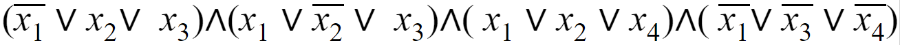

# 3-SAT Certifier (3 Satisfiability Problem)
A certifier algorithm for the NP-Complete 3-Satisfiability Problem

## Problem Statement
**Given a Conjunctive Normal Form formula, is there a satisfying truth assignment so that it evaluates to true?**  
  
- Each clause must have the same number of literals (e.g. X1, X2, X3)  
This is the 3-SAT problem so each clause has **exactly 3 literals**  
**But the code is generic enough that it work on any number of literals in a clause (given that each clase has the same number)**
- The literals in a clauses can have their value flipped using **NOT, the boolean negation**
- In each clauses, literals (or their negation) are combined with **compound boolean OR**
- Each clauses is combined with the next clause with **compount boolean AND**
- The final result of the CNF is eather `1` or `0` (`true` or `false`)
- **The 3-SAT problem asks if this result is `true`**

## Certifier Algorithm
This 3-SAT problem is NP-Complete, this not a solution to the problem statement  
**Instead, given a certificate of truth assignments, does the CNF evaluate to true?**  

## Code Details
- Literals must be **"Xi" where i is an integer** 
- Input for the CNF formula is a String with "AND" and "OR" spelled out
- String parsing is **case-insensitive**
- Input for certificates a `String` array. Each one in the form:
  - `(x1=1, x2=1, x3=0, x4=1)`

## Sample Certificates
The program parses the following strings to check if they're valid certificates to the CNF  
`(NOT x1 OR X2 OR x3) AND (x1 OR NOT x2 OR x3) AND (x1 OR x2 OR x4) AND (NOT x1 OR NOT x3 OR NOT x4)`
1. `(x1=1, x2=1, x3=0, x4=1)` **valid**
2. `(x1=1, x2=1, x3=1, x4=1)` **INVALID**
3. `(x1=0, x2=0, x3=0, x4=1)` **valid**
4. `(x1=0, x2=1, x3=0, x4=1)` **INVALID**
